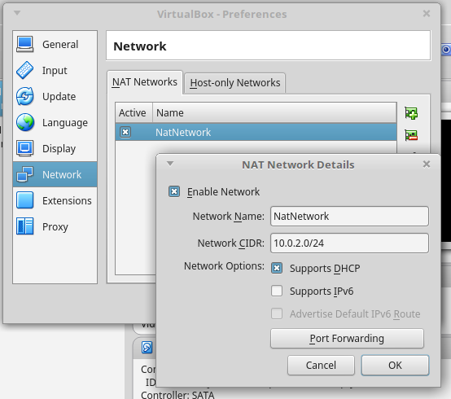
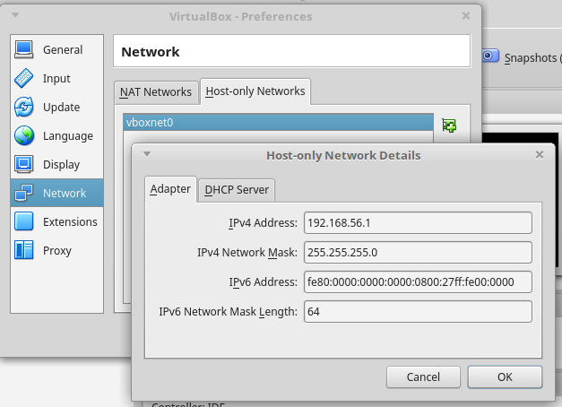
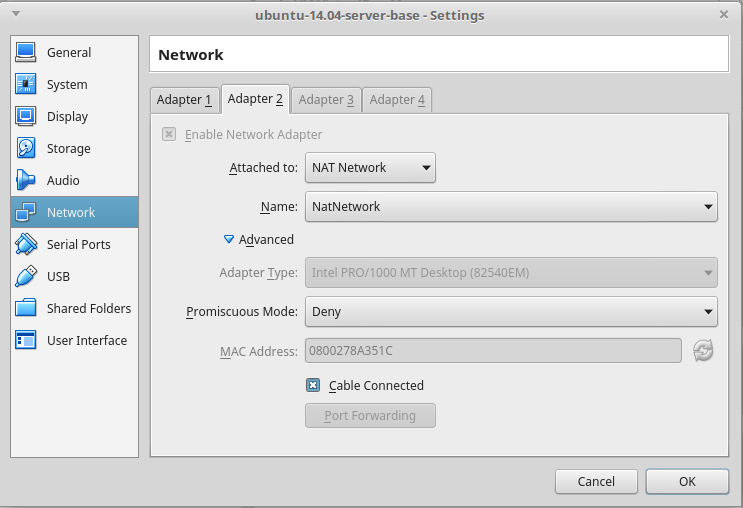
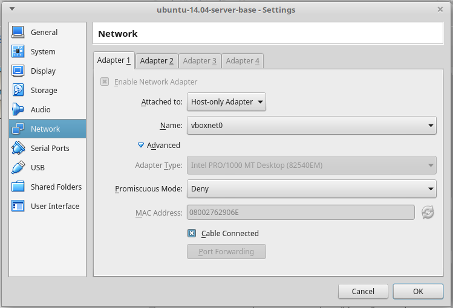

### Escuela Colombiana de Ingeniería
### Arquitecturas de Software - ARSW

## Escalamiento con balanceo de carga  Brokers de Mensajería y Balanceadores de carga

En este ejercicio va a crear un esquema de balanceo de carga a través de una red de máquinas virtuales (guest), las cuales sólo serán visibles desde la máquina 'host'.

### Dependencias
* Máquinas virtuales ubuntu

### Parte 0 - Entorno virtual

1. Importe la máquina virtual suministrada (extensión .ova).
2. Antes de iniciar la máquina virtual, configure las redes de VirtualBox (File/Preferences/Network). Si no está configurada, agregue una red NAT (NatNework) y otra red Host-only Network (vboxnet0)




3. Configure la máquina virtual (Settings/Network) y configure dos adaptadores de red. El primero de tipo 'Host-only' (asociado a la red vboxnet0), y el segundo de tipo NAT-Network (asociado a la red (NatNetwork).




3. Inicie la máquina virtual y autentíquese con   ubuntu / reverse .

4. Configure la máquina virtual para que active el segundo adaptador de red. Para eso, en la máquina virtual edite el archivo /etc/network/interfaces y agregue:

	```text
	auto eth1
	iface eth1 inet dhcp
	```
	
3. Reinicie la máquina y verifique que la máquina tenga salida a Internet. Para esto, haga PING a un servidor desde la máquina virtual.

4. Verifique que la máquina virtual sea accesible desde la máquina real. Revise la dirección IP (la que empieza con 192.168.56.) de la máquina virtual (comando ifconfig), e intente hacer ping desde la máquina real a dicha dirección. 

5. Apague la máquina virtual (sudo shutdown -P 0), y ahora cree un clon de la misma (clic-derecho sobre la máquina virtual  / Clone). No olvide elegir la opción de reiniciar la dirección MAC de los adaptadores de red, y haga un clonado de tipo 'Linked Clone'. Una vez clonado, rectifique que los adaptadores de red de la nueva máquina virtual tiene direcciones MAC diferentes a la máquina original.

7. Inicie ambas máquinas y verifique que queden con sus respectivas direcciones, y que éstas sean accesibles. Una vez verificado esto, puede conectarse a las máquinas virtuales a través de ssh (para no tener que usar la terminal de la máquina virtual):

	```text
	ssh ubuntu@192.168.56.XX
	```

# Parte 1

1. En uno de los dos servidores virtuales, inicie el servidor ActiveMQ. Para esto, ubíquese en el directorio apache-activemq-5.14.1/bin (en el directorio raíz del usuario 'ubuntu'), y ejecute ./activemq start .
2. Para verificar que el servidor de mensajes esté arriba, abra la consola de administración de ActiveMQ: http://IP_SERVIDOR:8161/admin/ (usuario/contraseña: admin/admin) . Consulte qué tópicos han sido creados en el momento.

3. Recupere la última versión del ejericio realizado de WebSockets (creación colaborativa de polígonos). Modifíquelo para que en lugar de usar el 'simpleBroker' (un broker de mensajes embebido en la aplicación), delegue el manejo de los eventos a un servidor de mensajería dedicado (en este caso, ActiveMQ).

	Es decir, en la configuración en lugar de:
	
	```java
	config.enableSimpleBroker("/topic");
	```
	
	Se configurará como:

	```java
	config.enableStompBrokerRelay("/topic/").setRelayHost("127.0.0.1").setRelayPort(61613);
	```

	Teniendo en cuenta que el parámetro 'relayHost' deberá tener la IP del host donde esté funcionando el servidor de mensajería.
	

4. Modifique, también en la configuración, el registro del 'endpoint', para que permita mensajes de otros servidores (por defecto sólo acepta de sí mismo). Eso es requerido para permitir el manejo del balanceador de carga:

	```nginx
	@Override
    	public void registerStompEndpoints(StompEndpointRegistry registry) {
        	registry.addEndpoint("/stompendpoint").setAllowedOrigins("*").withSockJS();        
	}
	```

<!--5. Modifique el manejador de los eventos interceptados por la aplicación (los que empiezan con /app), para que muestre por consola un mensaje cada vez que se recibe un evento.-->

6. Agregue las siguientes dependencias al proyecto:

	```
        <dependency>
            <groupId>org.springframework.integration</groupId>
            <artifactId>spring-integration-amqp</artifactId>            
        </dependency>
        <dependency>
            <groupId>io.projectreactor</groupId>
            <artifactId>reactor-core</artifactId>
            <version>2.0.8.RELEASE</version>
        </dependency>    

        <dependency>
            <groupId>io.projectreactor</groupId>
            <artifactId>reactor-net</artifactId>
            <version>2.0.8.RELEASE</version>
        </dependency>    
        <dependency>
            <groupId>io.netty</groupId>
            <artifactId>netty-transport</artifactId>
            <version>4.0.42.Final</version>
        </dependency>                                
        <dependency>
            <groupId>io.netty</groupId>
            <artifactId>netty-transport-native-epoll</artifactId>
            <version>4.0.42.Final</version>
        </dependency>                                

        <dependency>
            <groupId>io.netty</groupId>
            <artifactId>netty-handler</artifactId>
            <version>4.0.42.Final</version>
        </dependency>
	```

6. Copie la aplicación a los dos servidores virtuales (puede usar ssh, o publicarla en un repositorio GIT y luego clonarla desde cada máquina).

7. En cada máquina ejecute la aplicación, y desde el navegador (en la máquina real) verifique que las dos aplicaciones funcionen correctamente (usando las respectivas direcciones IP).

8. Al haber usado la aplicación, consulte nuevamente la consola Web de ActiveMQ, y revise qué información de tópicos se ha mostrado.


# Parte 2

Escoja uno de sus dos servidores como responsable del balanceo de carga. En el que corresponda, cree un archivo de configuración para NGINX

1. Cree un archivo de configuración NGINX (por convención, use la extensión .conf), compatible con WebSockets, a partir de la siguiente plantilla. Ajuste la configuración de 'upstream' para que use el host y el puerto de los dos servidores virtuales, y el parámero 'listen' para que escuche en el puerto 8090 (o cualquier otro, siempre que sea diferente al usado por la aplicación que está en el mismo servidor).

	```nginx
	
	events {
	    worker_connections 768;
	    # multi_accept on;
	}
	 
	http {
	 
	    log_format formatWithUpstreamLogging '[$time_local] $remote_addr - $remote_user - $server_name to: $upstream_addr: $request';
	 
	    access_log   access.log formatWithUpstreamLogging;
	    error_log    error.log;
	
	    map $http_upgrade $connection_upgrade {
	        default upgrade;
	        '' close;
	    } 
	
	    upstream simpleserver_backend {
	    # default is round robin
	        server localhost:8081;
	        server localhost:8082;
	    }
	 
	    server {
	        listen 8000;
	 
	        location / {
	            proxy_pass http://simpleserver_backend;
		    	proxy_http_version 1.1;
	            proxy_set_header Upgrade $http_upgrade;
	            proxy_set_header Connection $connection_upgrade;
	
	        }
	    }
	}
	```

2. Incie el servidor NGINX con:

	```bash
	nginx -c ruta-completa-archivo-configuración
	```

3. Desde un navegador, abra la URL de la aplicación, pero usando el puerto del balanceador de carga (8090). Verifique el funcionamiento de la aplicación.
4. Revise en la [documentación de NGINX](http://nginx.org/en/docs/http/load_balancing.html), cómo cambiar la estrategía por defecto del balanceador por la estrategia 'least_conn'.
5. Ejecute de nuevo la aplicación, pero esta vez abriendo la aplicación desde navegadores diferentes (p.e. Chrome y Firefox), y haciendo uso de la misma.
6. Revise, a través de los LOGs de cada servidor, si se están distribuyendo las peticiones. Revise qué instancia de la aplicación se le está asignando a cada cliente.
7. Apague una de las dos aplicaciones (Ctrl+C), y verifique qué pasa con el cliente que estaba trabajando con el servidor recién apagado.

8. Ajuste la aplicación para que la misma no tenga 'quemadas' datos como el host del servidor de mensajería o el puerto. Para esto revise [la discusión hecha en StackOverflow al respecto.](http://stackoverflow.com/questions/30528255/how-to-access-a-value-defined-in-the-application-properties-file-in-spring-boot)

9. Suba en moodle la nueva versión de la aplicación.\\

# Parte 3

En su ejercicio, haga una rama llamada 'cloud-based-mom'. En ésta, configure su aplicación para que en lugar de usar el servidor JMeter, haga uso del servicio en RabbitMQ en la nube de [CloudAMQP](https://www.cloudamqp.com), el cual también es compatible con STOMP. Para esto:

1. Regístrese en la plataforma y cree una instancia gratuita (Lemur).
2. Abra la consola de configuración, y revise las credenciales de acceso.
3. Abra el [siguiente ejemplo](https://github.com/hcadavid/SpringBoot_WebSockets_CloudBasedRelay_POC) y revise cómo se configuró el 'relay-broker' para usar el servicio de mensajería de CloudAMQP.
4. Ejecute la aplicación y revise su funcionamiento. Acceda a la consola de administración de CloudAMQP y revise qué efectivamente se estén creando los tópicos correspondientes.
5. Consulte 'benchmarks' comparativos entre RabbitMQ y ActiveMQ, y analice cual sería más conveniente.


# Parte 4 (Para el Martes en clase impreso).

1. Haga el diagrama de despliegue (incluyendo el detalle de los componentes de cada servidor) para la versión original del laboratorio.
2. Haga el diagrama de despliegue (incluyendo el detalle de componentes) para la nueva versión del laboratrio. En este caso suponga que los servidores no están en máquinas virtuales sino en máquinas reales.
3. Analice e indique, con la nueva arquitectura planteada qué problemas o inconsistencias se podrían presentar con la aplicación?. Qué solución plantearía al respecto?
